# Cinexa
> Cinexa — book, pay, and get notified in one flow.

Cinexa is a movie ticket booking platform spanning a Vite/React frontend, an Express/MongoDB backend, and a dedicated notification service. It lets moviegoers browse showtimes, reserve seats in real time, complete Stripe payments, and receive transactional emails end to end.

**Repositories**
- Core backend/API: https://github.com/jatin-sh01/CINEXA.git
- Frontend SPA: https://github.com/jatin-sh01/CINEXA-frontend.git
- Notification service: https://github.com/jatin-sh01/NotifiactionService.git

## Table of Contents
1. Overview
2. High-Level Design (HLD)
3. Low-Level Design (LLD)
4. Quick Start
5. Repository Layout
6. Environment Variables
7. Architecture
8. Service Overview
9. API / Event Flow Overview
10. Scripts & Running
11. Testing
12. Project Structure
13. Deployment
14. Timeline
15. Open Items

---

## Overview
Cinexa provides multiplex operators and moviegoers with a unified booking flow. The CINEXA backend/API exposes authentication, catalog, booking, payment, and notification trigger endpoints. CINEXA-frontend consumes those APIs to deliver browsing, seat selection, checkout, and profile management with Socket.IO-powered seat locks. NotifiactionService ingests notification events stored in MongoDB and delivers emails via Nodemailer with cron-based reminders. Together they solve the challenge of consistent seat inventory, frictionless payments, and dependable messaging.

## High-Level Design (HLD)
**System goals**
- Provide a responsive booking UI with real-time seat visibility.
- Guarantee transactional integrity from booking to payment confirmation.
- Deliver timely notifications and reminders without delaying API responses.

**Core components**
- CINEXA backend/API (Express, MongoDB, Stripe, Socket.IO).
- CINEXA-frontend (Vite, React, Tailwind, Stripe JS, Socket.IO client).
- NotifiactionService (Express worker with node-cron, Nodemailer, Mongoose).

**Flows**
- High-level request flow: browser → CINEXA REST endpoints → MongoDB/Stripe.
- Async flow: CINEXA persists notification jobs → NotifiactionService polls and sends emails → updates MongoDB.
- Real-time flow: Socket.IO channels broadcast seat statuses and booking confirmations between backend and connected clients.

**Inter-repo interactions**
- CINEXA-frontend calls CINEXA REST APIs and connects to Socket.IO for realtime seat locks.
- CINEXA backend pushes notification documents that the NotifiactionService reads through shared Mongo collections or internal HTTP hooks.
- Stripe webhooks hit CINEXA to finalize payments; SMTP relays (via Nodemailer) send to end users.

**Infra considerations**
- MongoDB handles all stateful domains and notification queues.
- Stripe manages card tokenization and settlement; only client/secret data is exposed to frontend.
- Socket.IO requires sticky sessions or a shared adapter (e.g., Redis) when scaling horizontally (TODO when load grows).
- SMTP providers must support TLS and throughput requirements; fallback providers are recommended for resiliency.

```mermaid
graph LR
	subgraph Client Layer
		FE[Cinexa Frontend (Vite/React)]
	end
	subgraph API Layer
		API[CINEXA Express API]
		WS[Socket.IO Server]
		Stripe[Stripe SDK]
	end
	subgraph Worker Layer
		NS[NotifiactionService]
		Cron[node-cron]
		Mail[Nodemailer]
	end
	DB[(MongoDB/Mongoose)]
	FE -->|REST / WebSocket| API
	API --> WS
	API -->|CRUD| DB
	API -->|Payment intents| Stripe
	Stripe -->|Webhooks| API
	API -->|Notification docs| DB
	NS -->|Poll + update| DB
	Cron --> NS
	NS --> Mail
	Mail --> User((Users))
	WS --> FE
```

### HLD: Frontend
- SPA served by Vite; uses React Router for page orchestration.
- Consumes REST endpoints for catalog/profile and Socket.IO for seat-lock/booking status.
- Integrates Stripe Elements for payment capture and Framer Motion for UI polish.

### HLD: Backend/API
- Express server orchestrates auth, catalog, booking, payment, and notification triggers.
- Exposes REST + Socket.IO; persists everything in MongoDB via Mongoose.
- Publishes notification entries for the worker and verifies Stripe webhooks.

### HLD: Notification Service
- Lightweight Express instance focused on background work.
- Polls MongoDB for pending notifications, applies retry policy, and uses Nodemailer for delivery.
- Cron schedules reminders (e.g., daily digest, showtime reminders).

### HLD: Data Storage
- Single MongoDB cluster hosts collections for users, movies, shows, seats, bookings, payments, and notifications.
- Ensures ACID-like behaviour through Mongoose transactions when locking seats and confirming bookings.

### HLD: External Integrations
- Stripe: creates payment intents and streams webhook callbacks.
- SMTP provider: sends confirmation, reminder, and failure emails.
- Optional CDN/hosting for frontend assets; reverse proxy terminates TLS for backend and websockets.

## Low-Level Design (LLD)
**Backend modules**
- `user/`, `movie/`, `show/`, `theater/`, `booking/`, `payment/`, `realtime/`, `shared/middlewares/`, `utils/`, `config/`.
- Controllers validate input, call services, and return consistent JSON envelopes.

**Data models**
- `User`: profile, hashed password (bcrypt), roles, notification preferences.
- `Movie`: metadata, runtime, rating, media assets.
- `Theater`: location, screens, seating chart template.
- `Show`: movie reference, theater screen, start/end, pricing tiers, seat map snapshot.
- `SeatState`: ephemeral locks tracked via Socket.IO and persisted when booking is created.
- `Booking`: user, show, seats, status (pending, confirmed, canceled), amount, Stripe payment intent id.
- `Payment`: Stripe intent/ref, currency, total, state.
- `Notification`: type, payload, recipient, status, retry count, scheduledAt.

**Validation & errors**
- Celebrate/Joi-style validation (assumed) or custom middleware ensures body/query correctness.
- `shared/middlewares/globalErrorHandler.js` converts thrown errors into structured responses.

**Seat-lock & booking logic**
- Socket.IO handlers (`seatGateway.js`) check seat availability using in-memory `seatState.js` plus fallback to DB.
- On lock request, backend sets TTL-based holds; conflicting requests return conflict events.
- Booking controller re-validates locks before persisting and creating Stripe intents.

**Payments & webhooks**
- `/api/payments/create-intent` creates PaymentIntent via Stripe SDK using server secret.
- `payment/stripeWebhook.js` validates signatures with `STRIPE_WEBHOOK_SECRET`, updates booking/payment status, and emits notification events.

**Socket.IO design**
- Namespaces per theater or show; events: `seat:lock`, `seat:unlock`, `seat:update`, `booking:confirmed`.
- Authentication via JWT handshake token; disconnect handler releases stale locks.

**Notifications flow**
- Backend writes notification document with type (booking_confirmation, reminder, failure_alert) and `status=pending`.
- NotifiactionService polls pending docs, locks them, sends via Nodemailer, and marks `sent` or increments retries.
- Failed attempts beyond `RETRY_LIMIT` move to `status=dead_letter` (TODO: expose dashboard).

**Frontend state & components**
- Global auth context stores JWT and refreshes on login/register.
- `useFetch` hooks wrap API calls; SWR-like caching for movies/shows.
- Seat selector component uses local state for seat map plus Socket.IO events for occupancy.
- Payment form integrates Stripe Elements and handles error/success states.

**Cron/jobs**
- `cron/cron.js` schedules tasks (e.g., hourly reminder sweep) using node-cron; tasks call service layer to enqueue emails.

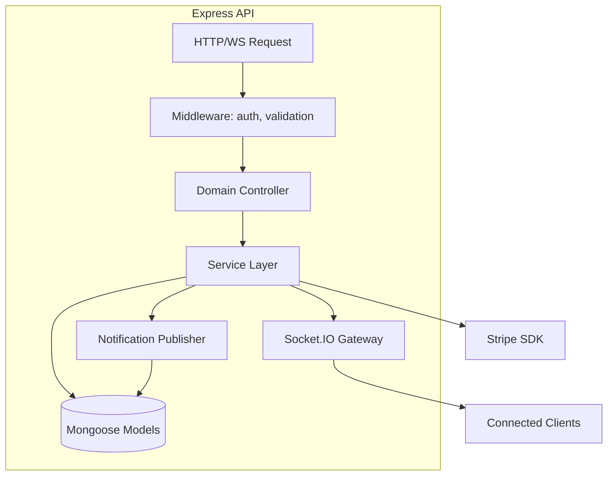

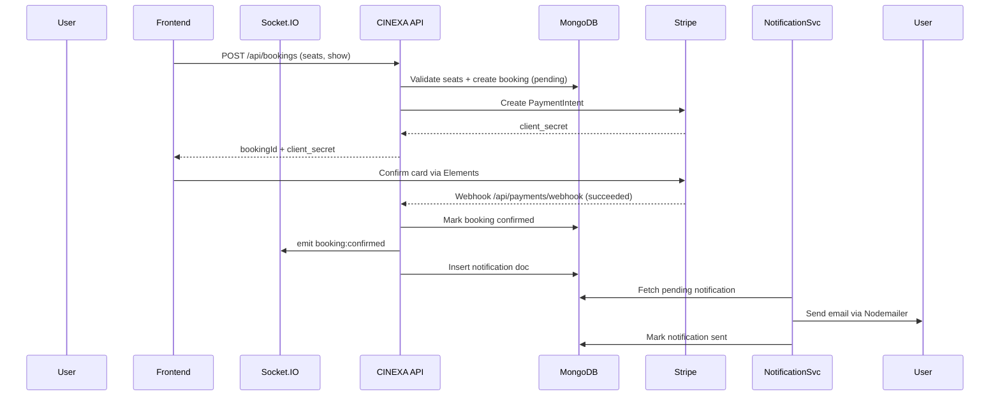

**Key entities summary**
- `User`: owns bookings, has auth credentials, notification preferences.
- `Movie`: metadata; referenced by shows.
- `Show`: schedule entry linking movie and theater; contains seat map.
- `Seat`: derived entity representing location row/column and availability.
- `Booking`: ties user, show, selected seats, amount, and status.
- `Payment`: tracks Stripe intent details and status transitions.
- `Notification`: queued message with type, payload, recipient, retries.

## Quick Start
### Prerequisites
- Node.js ≥ 20.x, npm ≥ 10.x
- MongoDB connection string (local or Atlas)
- Stripe account with test keys (secret + publishable + webhook secret)
- SMTP credentials compatible with Nodemailer

### Clone & install
```bash
# Clone repositories (adjust org/user names)
git clone https://github.com/<org>/CINEXA.git
git clone https://github.com/<org>/Cinexa-frontend.git
git clone https://github.com/<org>/NotifiactionService.git

# Install dependencies
cd CINEXA && npm install
cd ../Cinexa-frontend/cinexa-frontend && npm install
cd ../../NotifiactionService && npm install
```

### Environment files
Create `.env` in each repo using the tables below. (TODO: add committed `.env.example` files.)

### Run services
```bash
# Backend/API (http://localhost:3000)
cd CINEXA
npm run dev

# Frontend (http://localhost:5173)
cd ../Cinexa-frontend/cinexa-frontend
npm run dev

# Notification Service (http://localhost:3001)
cd ../../NotifiactionService
npm run dev
```

## Repository Layout
- **CINEXA**: Authentication, movies, shows, seats, bookings, payments, Stripe webhooks, Socket.IO realtime state, notification event generation.
- **CINEXA-frontend**: User-facing SPA for browsing, seat selection, checkout, user profile, admin management, notification display.
- **NotifiactionService**: Background processing of notification jobs, reminder scheduling, email delivery, retry/backoff, cron jobs.

## Environment Variables
### CINEXA backend/API
| Key | Required | Description | Example |
| --- | --- | --- | --- |
| PORT | optional | HTTP port for Express | 3000 |
| NODE_ENV | optional | `development` or `production` | development |
| MONGODB_URI | required | MongoDB connection string | mongodb+srv://cinexa... |
| JWT_SECRET | required | Secret for signing JWT access tokens | supersecretvalue |
| JWT_EXPIRES_IN | optional | Access token lifetime | 1d |
| CORS_ORIGIN | required | Allowed REST origins | http://localhost:5173 |
| SOCKET_CORS_ORIGIN | required | Allowed Socket.IO origins | http://localhost:5173 |
| STRIPE_SECRET_KEY | required | Server-side Stripe API key | sk_test_123 |
| STRIPE_WEBHOOK_SECRET | required | Stripe webhook signature secret | whsec_123 |
| EMAIL_HOST | required | SMTP host | smtp.mailgun.org |
| EMAIL_PORT | required | SMTP port | 587 |
| EMAIL_USER | required | SMTP username | api |
| EMAIL_PASS | required | SMTP password | ******** |
| NOTIFICATION_SERVICE_URL | optional | Internal hook for notification worker | http://localhost:3001 |
| FRONTEND_URL | optional | Used in transactional emails | https://cinexa.app |
| LOG_LEVEL | optional | Logging verbosity | info |

### CINEXA-frontend
| Key | Required | Description | Example |
| --- | --- | --- | --- |
| VITE_API_BASE_URL | required | Base URL for REST calls | http://localhost:3000 |
| VITE_SOCKET_URL | required | Socket.IO endpoint | http://localhost:3000 |
| VITE_STRIPE_PUBLISHABLE_KEY | required | Stripe client key | pk_test_123 |
| VITE_ENV | optional | Build flag | development |
| VITE_SENTRY_DSN | optional/TODO | Monitoring DSN (if used) | TODO |

### NotifiactionService
| Key | Required | Description | Example |
| --- | --- | --- | --- |
| PORT | optional | Worker HTTP port | 3001 |
| NODE_ENV | optional | `development` or `production` | development |
| MONGODB_URI | required | Mongo connection shared with API | mongodb+srv://cinexa... |
| EMAIL_HOST | required | SMTP host | smtp.mailgun.org |
| EMAIL_PORT | required | SMTP port | 587 |
| EMAIL_USER | required | SMTP username | api |
| EMAIL_PASS | required | SMTP password | ******** |
| CRON_SCHEDULE | required | Cron expression for reminder job | 0 * * * * |
| RETRY_LIMIT | optional | Max delivery attempts | 3 |
| RETRY_BACKOFF_MS | optional | Delay between retries | 60000 |
| API_SECRET | optional | Shared secret for internal endpoints | TODO |

## Architecture
Cinexa splits concerns across client, API, and worker layers. The frontend handles routing, seat visualization, and payment UI. The backend enforces business logic, stores data in MongoDB, interacts with Stripe, and exposes Socket.IO events. The notification service continuously processes pending notifications and manages retries.

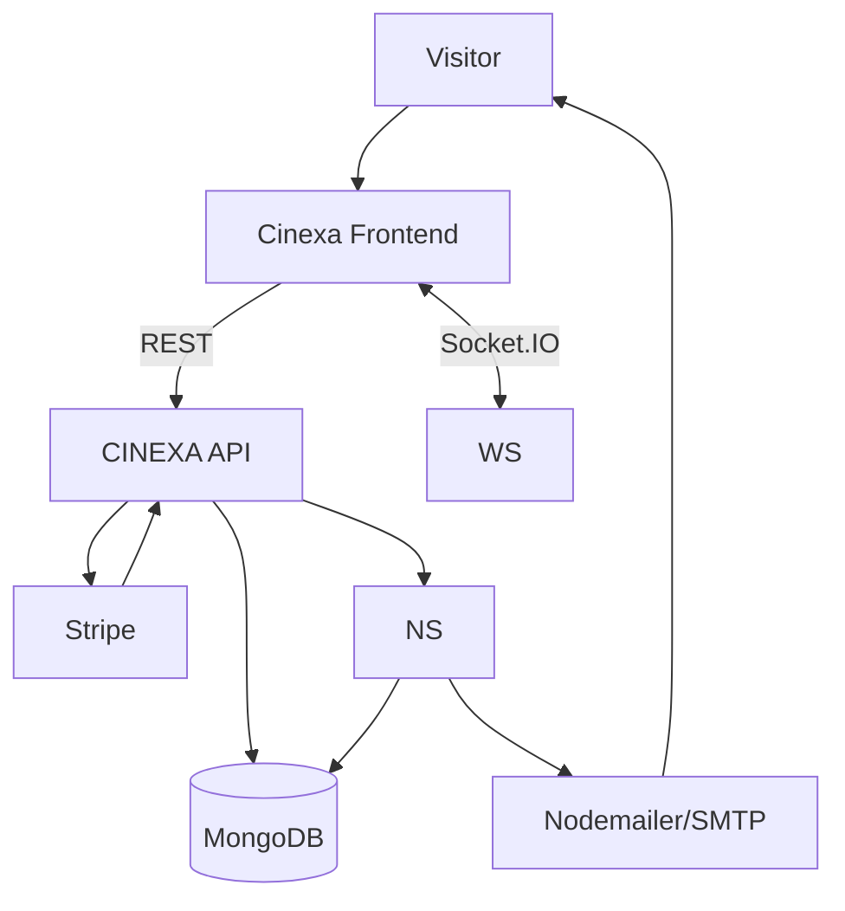

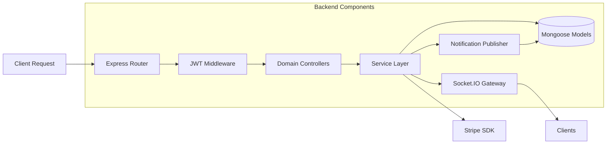

## Service Overview
### CINEXA-frontend
- React Router organizes pages (Home, Movies, Shows, Booking, Payment, Admin).
- Components such as `HeroSlider`, `MovieRow`, `SeatSelector`, and `PaymentForm` orchestrate browsing to checkout.
- AuthContext manages JWT tokens, ensuring protected routes and profile actions.
- Socket.IO client subscribes to seat status rooms, instantly reflecting locks/unlocks.
- Stripe JS + Elements capture payment details securely and relay intents to the API.
- Tailwind CSS, Framer Motion, and Swiper power responsive layouts and animations.

### CINEXA backend/API
- Express routes under `/api` handle authentication, catalog, booking, payment, and notification endpoints.
- JWT middleware secures protected routes; bcrypt handles password hashing.
- Booking logic validates seat availability, records holds, and finalizes on successful Stripe webhook events.
- Socket.IO namespace per show/theater broadcasts seat changes and booking confirmations.
- Mongoose models abstract MongoDB interactions with reusable schemas and hooks.
- Nodemailer email service handles immediate transactional emails while also emitting notification jobs for the worker.

### NotifiactionService
- Provides internal endpoints for manual trigger/testing plus cron-driven jobs.
- Polls the `ticketNotification` collection for pending messages and locks them before sending.
- Uses Nodemailer transport with TLS and authentication.
- Applies retry counters and configurable backoff; exhausted jobs marked for manual review.
- Logs outcomes per notification for auditing and observability.

## API / Event Flow Overview
### User signup/login flow
Steps: user submits credentials → backend validates → JWT issued → frontend stores token.

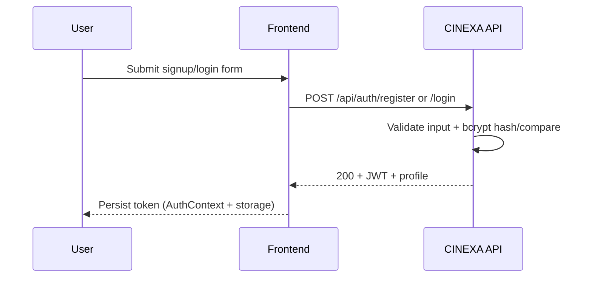

### Browse movies and shows flow
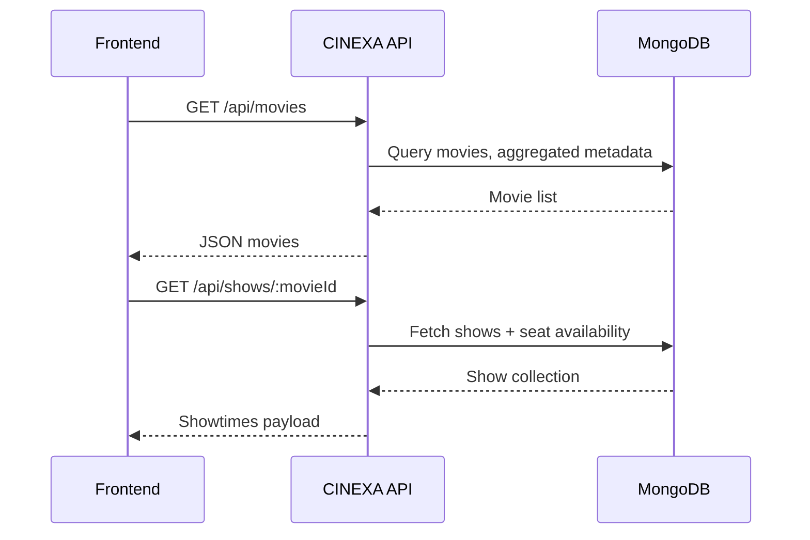

### Seat selection and booking flow
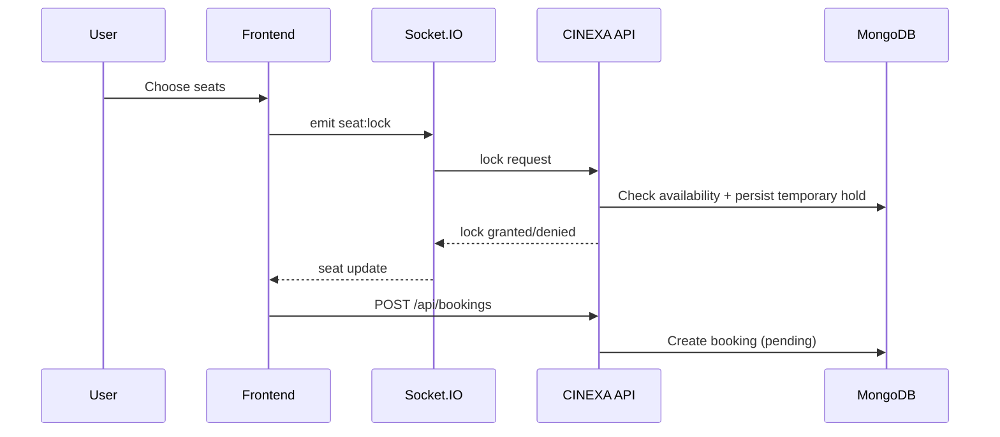

### Payment flow
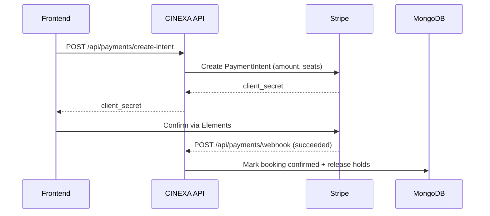

### Notification dispatch flow
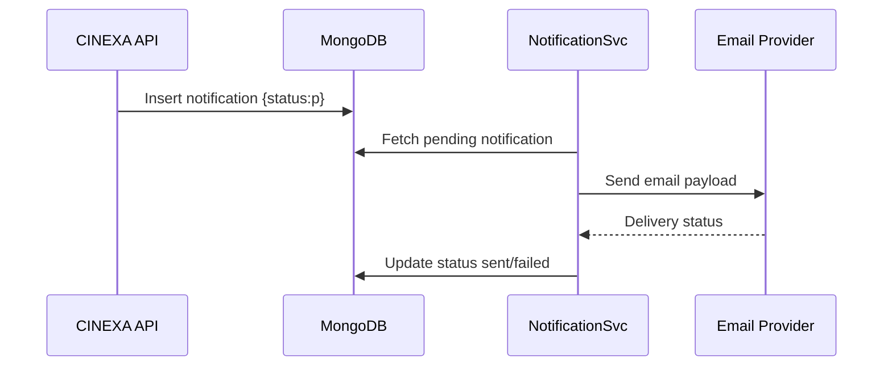

### Read/unread notification flow
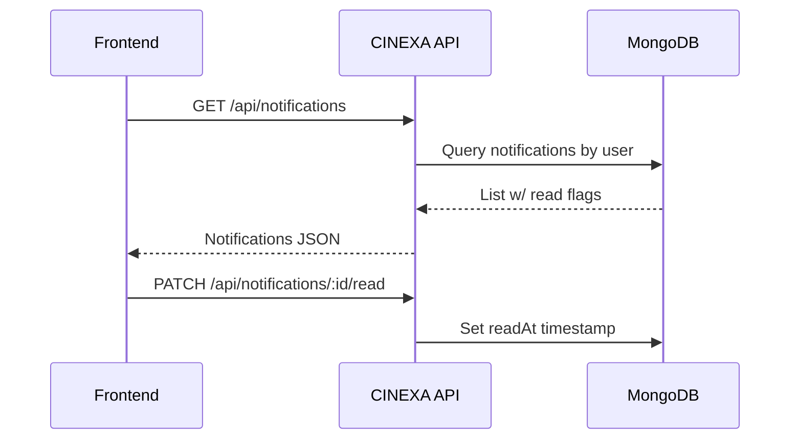

### Retry/failure flow
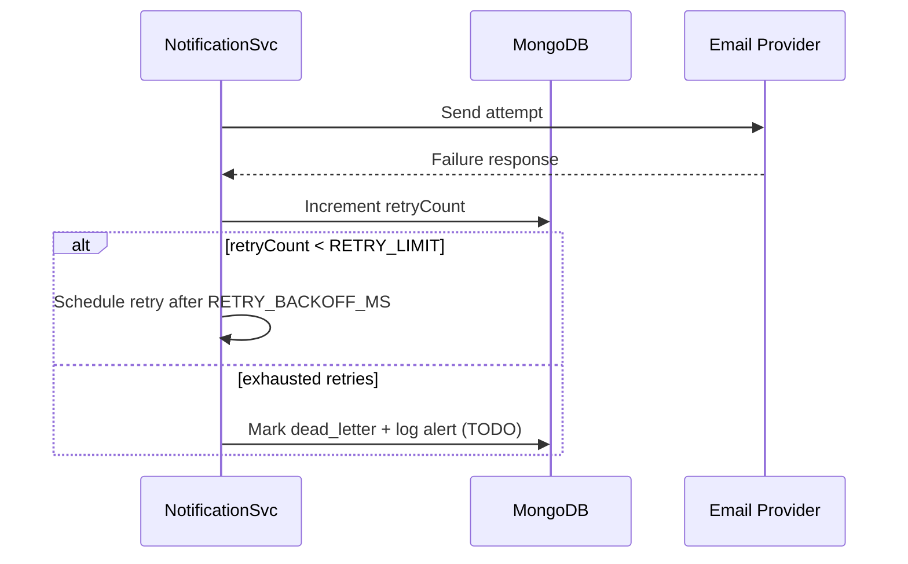

## Scripts & Running
### CINEXA backend/API
| Command | Description |
| --- | --- |
| `npm install` | Install dependencies |
| `npm run dev` | Start development server with nodemon (server.js) |
| `npm start` | Run production server |
| `npm test` | Placeholder (currently fails intentionally) |

### CINEXA-frontend
| Command | Description |
| --- | --- |
| `npm install` | Install dependencies |
| `npm run dev` | Vite development server |
| `npm run build` | Production build |
| `npm run preview` | Preview built assets |
| `npm run lint` | ESLint over src |

### NotifiactionService
| Command | Description |
| --- | --- |
| `npm install` | Install dependencies |
| `npm run dev` | Nodemon watcher for worker + cron |
| `npm start` | Production worker |
| `npm test` | Placeholder (returns exit 0 without assertions) |

## Testing
- **Current status**: automated tests are not implemented in any repository.
- **Recommended**:
  - Backend/API: Jest + Supertest for controllers, Stripe webhook contract tests, Socket.IO integration tests.
  - Frontend: Vitest + React Testing Library for components, Cypress for end-to-end booking + payment flows.
  - Notification Service: Jest for cron/task functions with Nodemailer transport mocks.
  - Cross-service: contract tests verifying booking-payment-notification workflow.

## Project Structure
### CINEXA
```
CINEXA/
├── server.js
├── eslint.config.mjs
├── src/
│   ├── app.js
│   ├── config/
│   │   ├── config.js
│   │   ├── db.js
│   │   └── stripe.js
│   ├── shared/
│   │   └── middlewares/
│   │       └── globalErrorHandler.js
│   ├── utils/
│   │   ├── constants.js
│   │   └── emailService.js
│   ├── realtime/
│   │   ├── io.js
│   │   ├── seatGateway.js
│   │   └── seatState.js
│   ├── user/
│   ├── movie/
│   ├── show/
│   ├── theater/
│   ├── booking/
│   └── payment/
└── public/
```

### CINEXA-frontend
```
Cinexa-frontend/
└── cinexa-frontend/
	├── src/
	│   ├── api/
	│   ├── components/
	│   ├── contexts/
	│   ├── hooks/
	│   ├── layouts/
	│   ├── pages/
	│   ├── services/
	│   ├── utils/
	│   └── data/
	├── public/
	├── App.jsx
	├── main.jsx
	├── App.css
	└── tailwind.config.js
```

### NotifiactionService
```
NotifiactionService/
├── index.js
├── controller/
├── routes/
├── services/
├── models/
├── middleware/
├── cron/
├── utils/
└── .github/workflows/
```

## Deployment
- **Frontend**: Build using `npm run build`, deploy static bundle to Vercel/Netlify/S3+CloudFront. Configure environment variables via hosting platform; ensure CORS/Sockets point to backend domain.
- **Backend/API**: Deploy on Node hosts (Render, Railway, EC2, Azure App Service). Use reverse proxy (NGINX) for TLS termination and WebSocket upgrades. Configure environment secrets securely (Vault, AWS SM). Consider PM2 for process management and horizontal scaling with shared Socket.IO adapter.
- **Notification Service**: Deploy as worker container or VM with cron support. Ensure outbound SMTP connectivity and shared Mongo access. Use process manager for retries, and pipe logs to centralized monitoring (e.g., Loki, CloudWatch).
- **Shared recommendations**: Add CI/CD pipelines (GitHub Actions) for lint/test/build, containerize with Docker Compose for parity, enable observability (Grafana, Sentry), and configure health/readiness endpoints for load balancers.

## Timeline
- **Phase 1**: Core API + MongoDB schemas (auth, movies, shows, bookings).
- **Phase 2**: Frontend implementation (routing, seat selector, payment UI).
- **Phase 3**: Notification service (cron jobs, Nodemailer, retries).
- **Phase 4**: Stripe integration + webhook hardening + Socket.IO scaling review.
- **Phase 5**: Documentation, deployment automation, monitoring rollout.

## Open Items
- Add `.env.example` files for every repository.
- Implement automated tests (unit, integration, E2E).
- Publish API documentation (OpenAPI/Swagger) and developer portal.
- Introduce CI/CD pipelines, lint + test gates, and quality checks.
- Provide Dockerfiles and Compose stack for local/dev deployments.
- Add centralized logging/metrics/alerting.
- Harden validation and rate limiting across public endpoints.
- Enhance notification dead-letter queues and administrative tooling.
- Expose /health and /ready endpoints for all services.
- Document Stripe key rotation and incident response runbooks.
